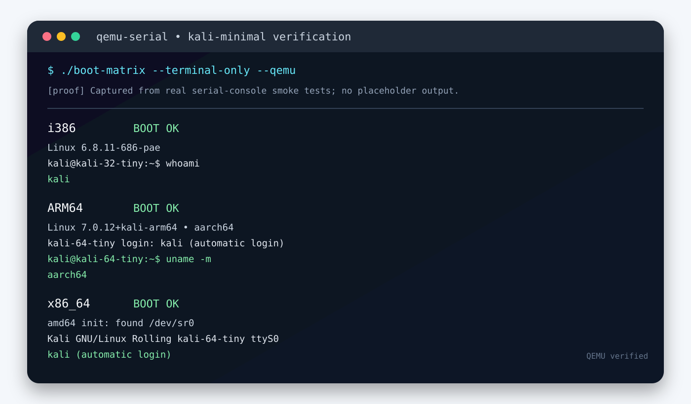

<div align="center">

# kali-minimal

### Ultra-minimal, terminal-only Kali Linux images for small virtual machines

<p>
  <a href="https://github.com/Quincunx33/kali-minimal/releases"></a>
  <a href="https://github.com/Quincunx33/kali-minimal/releases"></a>
  <a href="https://github.com/Quincunx33/kali-minimal/releases"></a>
</p>

<p>
  Small Kali Linux live images for <strong>i386</strong>, <strong>ARM64</strong>, and <strong>x86_64</strong> virtualization targets.
  No desktop environment. No graphical installer. Just a compact bootable terminal.
</p>

</div>



> **Project status:** The released images have been boot-tested in QEMU through serial or text consoles. This repository distributes release artifacts rather than a source build system.

## Why this project exists

Modern Kali images are powerful, but they are not always a good fit for a low-memory emulator, an older computer, or a phone running a virtual machine. `kali-minimal` explores a deliberately narrow alternative: a bootable terminal environment with a small live payload, automatic console login, and a basic network path that can be extended after boot.

These images are useful for shell practice, lightweight administration tasks, package experiments, rescue work, and testing command-line tooling in QEMU-compatible environments. They are **not** intended to replace a full Kali installation or provide the complete Kali tool collection out of the box.

## Image matrix

| Architecture | Release | Asset | Approx. size | Firmware / target | Verified result |
|:--|:--|:--|--:|:--|:--|
| **i386 / 32-bit x86** | [v1.0.0](https://github.com/Quincunx33/kali-minimal/releases/tag/v1.0.0) | [kali-32bit-ultra-mini.iso](https://github.com/Quincunx33/kali-minimal/releases/download/v1.0.0/kali-32bit-ultra-mini.iso) | 174 MiB | Legacy BIOS, i440FX-style QEMU machine | Reached `kali@kali-32-tiny:~$` |
| **ARM64 / aarch64** | [v1.1.0-arm64](https://github.com/Quincunx33/kali-minimal/releases/tag/v1.1.0-arm64) | [kali-arm64-ultra-mini.iso](https://github.com/Quincunx33/kali-minimal/releases/download/v1.1.0-arm64/kali-arm64-ultra-mini.iso) | 305 MiB | UEFI, QEMU `virt` | Reached automatic `kali` login on `kali-64-tiny` |
| **x86_64 / amd64** | [v1.2.0-amd64](https://github.com/Quincunx33/kali-minimal/releases/tag/v1.2.0-amd64) | [kali-amd64-ultra-mini.iso](https://github.com/Quincunx33/kali-minimal/releases/download/v1.2.0-amd64/kali-amd64-ultra-mini.iso) | 186 MiB | Legacy BIOS, IDE CD-ROM, serial console | Found `/dev/sr0` and reached `ttyS0` automatic login |

The sizes above are the published asset sizes rounded to the nearest MiB. Each release page contains the corresponding checksum file when available.

## Download and verify

Download the image for the target architecture from the table above. For the amd64 release, the checksum file is available directly here:

```text
https://github.com/Quincunx33/kali-minimal/releases/download/v1.2.0-amd64/SHA256SUMS-amd64.txt
```

Verify an image locally with:

```bash
sha256sum kali-amd64-ultra-mini.iso
```

The calculated digest should match the value published in the release checksum file. Do not skip this step when transferring a large ISO to a phone, removable storage, or a virtual machine host.

## QEMU

The following command starts the amd64 image as a serial-only guest with user-mode networking:

```bash
qemu-system-x86_64 \
  -M pc \
  -m 768 \
  -smp 2 \
  -cdrom kali-amd64-ultra-mini.iso \
  -boot d \
  -nographic \
  -serial mon:stdio \
  -nic user,model=e1000
```

For the i386 image, use `qemu-system-i386` and the i386 ISO. For ARM64, use an ARM64-capable QEMU setup with the `virt` machine and UEFI firmware appropriate for the host environment. The ARM64 image is not a drop-in BIOS image for an x86 virtual machine.

A successful terminal boot should eventually show a prompt similar to:

```text
Kali GNU/Linux Rolling kali-64-tiny ttyS0
kali-64-tiny login: kali (automatic login)
kali@kali-64-tiny:~$
```

## UTM SE

Create a new virtual machine for the matching architecture, attach the ISO as a CD/DVD device, and select a **text or serial console** where the emulator allows it. For the amd64 image, use an **x86_64 PC/BIOS** machine with at least **512 MiB RAM**; 768 MiB or more is preferable for a smoother first boot. Disable expectations of a graphical desktop: these images intentionally provide a terminal environment only.

ARM64 requires an ARM64 virtual machine profile and UEFI-compatible boot configuration. Do not attach the ARM64 image to an x86_64 machine profile, and do not attach the i386 image to an ARM64 profile without an appropriate full-system emulation layer.

## Login and networking

The images are configured around a lightweight `kali` user and terminal autologin on the tested console. The amd64 image enables `serial-network.service`; after systemd starts, the service brings up non-loopback interfaces and requests DHCP through the bundled DHCP client. QEMU user-mode networking can provide a simple outbound path, while bridged or host-only networking depends on the emulator and host configuration.

After login, useful first checks are:

```bash
whoami
uname -m
ip link
ip route
```

The base image is intentionally small. Install only the packages required for the workload, and remember that package installation increases disk usage beyond the published ISO size.

## What is included—and what is not

The images contain a minimal Kali Linux Rolling base with a terminal, a live SquashFS root, boot support for their intended architecture, and basic networking configuration. They do **not** contain a graphical desktop, a graphical installer, or the full Kali metapackage. The project also does not claim that every physical device, emulator frontend, firmware combination, or third-party UTM configuration will work identically.

This repository intentionally keeps large binaries out of the Git history. ISO files are distributed through GitHub Releases, which keeps the repository itself lightweight and makes each architecture independently downloadable.

## Boot verification

The proof image above is generated from captured serial-console output from the actual QEMU smoke tests. The key markers are:

| Target | Evidence captured |
|:--|:--|
| i386 | Linux i686 kernel booted to `kali@kali-32-tiny:~$` and accepted shell commands. |
| ARM64 | ARM64 kernel booted to `kali-64-tiny`; the serial log records automatic `kali` login and `uname -m` returning `aarch64`. |
| amd64 | The custom initramfs detected `/dev/sr0`, mounted the live medium, and reached `Kali GNU/Linux Rolling kali-64-tiny ttyS0` with automatic login. |

The repository does not fabricate ratings, testimonials, or user reviews. The evidence here is limited to the recorded build and boot checks described above.

## Releases

- [All releases](https://github.com/Quincunx33/kali-minimal/releases)
- [i386 v1.0.0](https://github.com/Quincunx33/kali-minimal/releases/tag/v1.0.0)
- [ARM64 v1.1.0-arm64](https://github.com/Quincunx33/kali-minimal/releases/tag/v1.1.0-arm64)
- [amd64 v1.2.0-amd64](https://github.com/Quincunx33/kali-minimal/releases/tag/v1.2.0-amd64)

## References

[1]: https://www.qemu.org/docs/master/system/ QEMU System Emulation documentation
[2]: https://docs.getutm.app/ UTM documentation
[3]: https://www.kali.org/docs/ Kali Linux documentation

This project is an independent minimal-image experiment and is not an official Kali Linux distribution release.
